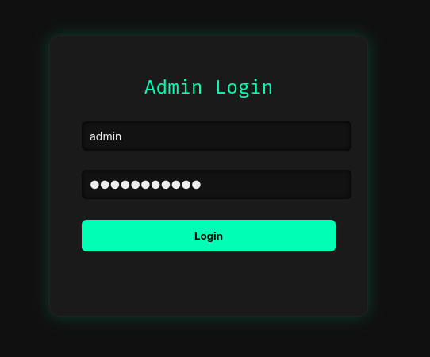
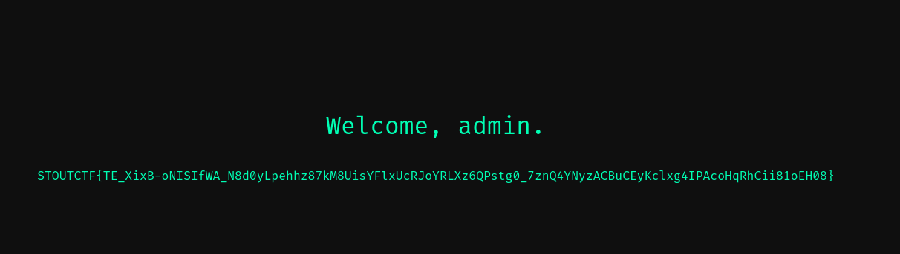

> This writeup can also be viewed [here](https://slavetomints.com/posts/stoutctf-admin-login-part-1/)

> Challenge description:
>
>We stumbled across this login form. Can you find the flag on the admin dashboard?

All right! A fun web challenge! Let's do this!

All right, one of the first things that I like to do with any web form, is see if its vulnerable to any sort of injection. SQL injections are easy to find, which is good for you since you don't have to do much to actually verify that it exists. Let's try first by submitting `admin:password` for good measure.

Yeah, I don't really want to use brute force, it can take a long time, is super noisy, and only works until they change their password. So let's try with some SQL injection.

But first, let's try to think about what's actually being executed on the backend first. Once we have a good idea of that, we can probably get a valid injection on the first try.

So, we are giving the application a username, and a password. They need to check both the username, and the password to see if its valid. For this, you are commonly using a `SELECT` statement. Here's the kicker though, if they don't properly sanitize their SQL, then you can send them SQL, and get it to execute. That's the whole injection part of SQL injection.

For example, if they have the statement `SELECT * FROM users WHERE username = '{user supplied value}'`

And for that user supplied value, all you need to give is something that always will be true, and then you get all the users. That's why you give them something like `' OR 1=1 --`. The quote stops the string, and sets up for the next part. The `OR` statement makes it so that only one thing in the statement needs to be true for it to be truthy, and the `1=1` is the true thing. The `--` is just a comment to comment out the rest of the statement we are injection into, to prevent there form being any errors.

So now let's expand upon that original idea. If we're comparing both username and password, their statement is probably like `SELECT * FROM users WHERE username = '{username}' AND password = '{password}'`

Since we know the admin username (its `admin`), let's try to inject on the password field. This way, we send `admin` as the username, and `' OR 1=1 --` as the password. This make the SQL statement executed on the server this:

`SELECT * FROM users WHERE username = 'admin' AND password = '' OR 1=1 --'`

See how the injection closed the quotes, to prevent errors, gave an always true condition, and then commented out the original closing quote to prevent an error? This is what we want in the injection. let's try it out!

Heyyy look at that! We got the flag! If you're wondering about the flag length, its an auto-generated unique flag by CTFd to prevent cheating.

FLAG: `STOUTCTF{TE_XixB-oNISIfWA_N8d0yLpehhz87kM8UisYFlxUcRJoYRLXz6QPstg0_7znQ4YNyzACBuCEyKclxg4IPAcoHqRhCii81oEH08}`