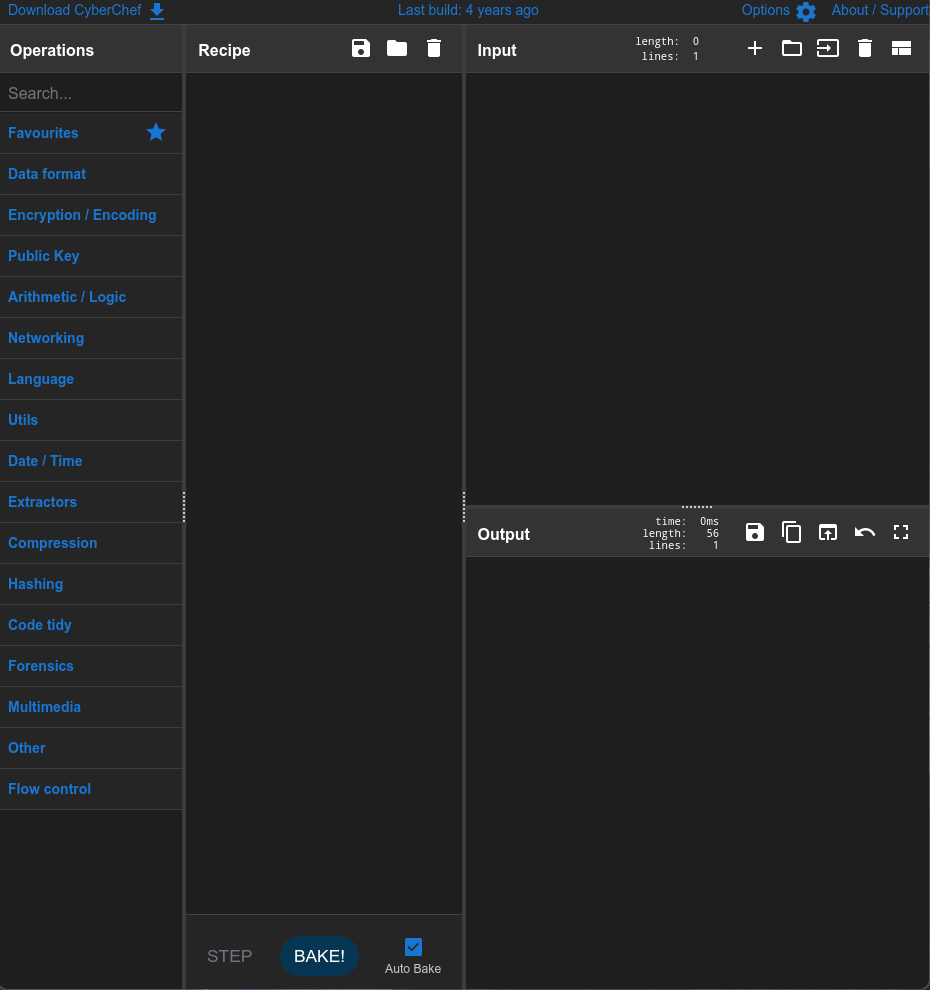
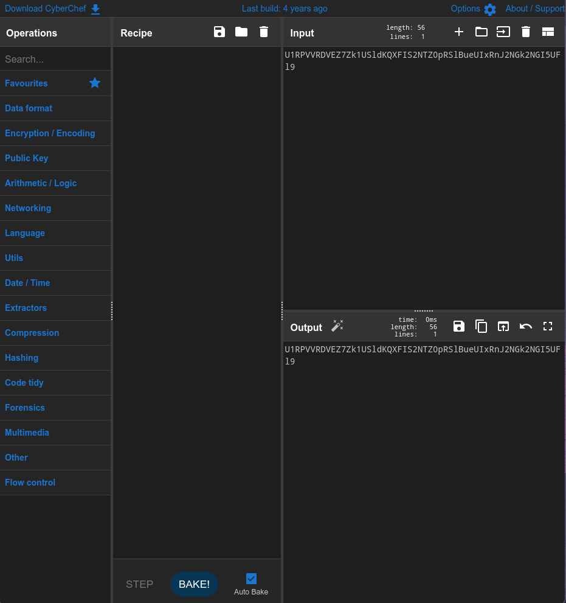
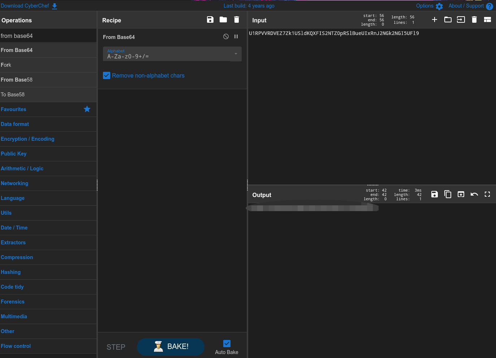

> This writeup can also be viewed [here](https://slavetomints.com/posts/guides-cyber-chef-i/)

Can you decode this ciphertext?

`U1RPVVRDVEZ7Zk1USldKQXFIS2NTZ0pRSlBueUIxRnJ2NGk2NGI5UFl9`

## Walkthrough

Welcome to the CyberChef Walkthroughs! Here we are going to go through the basics of CyberChef, with a few extra challenges at the end for you to work on.

To start, talk about what CyberChef is (You can find it [here](https://cyberchef.io)).

CyberChef is a security tool created by the GCHQ, who is the UK's intelligence, security and cyber agency. They describe it as:

> CyberChef is a simple, intuitive web app for carrying out all manner of "cyber" operations within a web browser. These operations include simple encoding like XOR and Base64, more complex encryption like AES, DES and Blowfish, creating binary and hexdumps, compression and decompression of data, calculating hashes and checksums, IPv6 and X.509 parsing, changing character encodings, and much more.

CyberChef works of off something called recipes, which are any number of basic operations built on top of each other. You can see the building blocks on the left-hand side of the application. Sometimes you only need one, sometimes you need multiple blocks to work through your text. We will be starting basic, and moving on from there.

So lets place our ciphertext into the input section of CyberChef. Your screen should now look like this:

*"Look Ma I have input!!!"*

Okay, now, if you didnt know already, the input that we have is Base64 encoded. If you want to learn more about Base64, check out its [Wikipedia Article](https://en.wikipedia.org/wiki/Base64). In order to decode it, we can search `From Base64`, and drag it into our recipe. See how in the output, there now is our decoded string!

Congrats on using CyberChef for the first time!

FLAG: `STOUTCTF{fMTJWJAqHKcSgJQJPnyB1Frv4i64b9PY}`