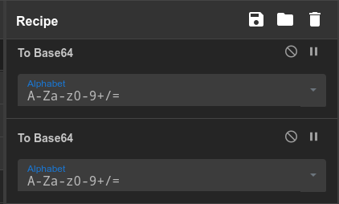

> This writeup can also be viewed [here](https://slavetomints.com/posts/guides-cyber-chef-ii/)

Can you decode this ciphertext?

`Vm0wd2QyUXlWa1pPVldSWFYwZG9WVll3Wkc5WFJsbDNXa2M1V0ZKdGVGWlZNbmhQVjBaYWRHVkliRmhoTVhCUVZtcEJlRmRIVmtkWGJGcHBWMFpHTTFacVFtRlRNazE0V2toV2FsSnRVazlaVjNoaFlqRmFjbHBJY0d4U2JWSkpWbGQwVjFZeVNsWlhiR2hYWWxSV1JGcFdXbXRXTVdSMFpFWlNUbFp1UVhkV1ZFb3dWakZrU0ZOclpHcFNWR3hoVm1wT2IyRkdiSEZTYlVacVZtczFNVmt3WkRSVk1rcEpVV3BhVjAxdVVuWldSRVpYWkVaT2NtSkdTbWxXUjNoWFZtMHhOR1F3TUhoalJtUllZbFZhY1ZsclduZE5SbkJHVjIxR1ZXSkdjREJhU0hCRFZqSkZlVlJZYUZaaGExcG9Xa1ZhVDJOc2NFaGpSbEpUVmxoQ1dWWXhaRFJpTVZWM1RVaG9WMkpyV2xSWmJGWmhWMFpTVjFwR1RrNVNia0pIVjJ0b1QxWlhTa2RqU0hCYVlXczFjbFpxUm1GT2JFcFpXa1p3YkdFelFrbFhXSEJIVlRKT2MxcElUbWhTTW5odlZGUkNTMWRHV25STlJFWnJUVlZzTlZaWE5VOVhSMHB6VTI1T1ZrMUhVbFJXYkZwWFl6RldjbHBHWkU1V01VbzFWbXBLTkZReFdYZE5XRXBYWVd4d1YxWnFUbEprTVZweFVWaG9hMVpzV25wV1YzaDNWRzFLZEdGRlZsZGlSMUV3VlZSR1lWWnJNVlpXYXpWVFVrVkZOUT09`

## Walkthrough

Welcome back to the CyberChef Walkthroughs! Here we are going to go through the basics of CyberChef, with a few extra challenges at the end for you to work on.

This time, we are going to talk about stacking up blocks to make a full fledged recipe. Last time we learned how to use just one block, but that's pretty boring. We want to really start to push CyberChef to its limits.

All you need to do is drag another block down onto the recipe, and voilà, you have it!

*Its really that easy?*

Now, try and figure out how many `From Base64` blocks are needed to decode this message. (Hint hint, its more than two!)

FLAG: `STOUTCTF{rUgorocQNlGKuRxRTDAhQhzjwhTvaHDw}`