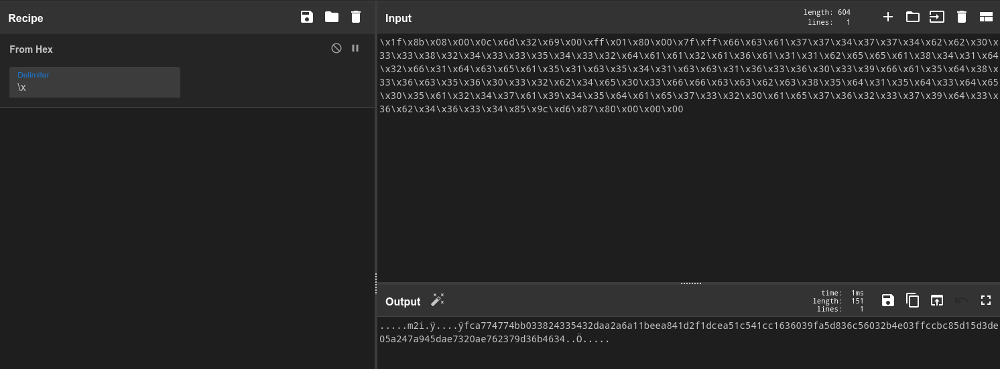
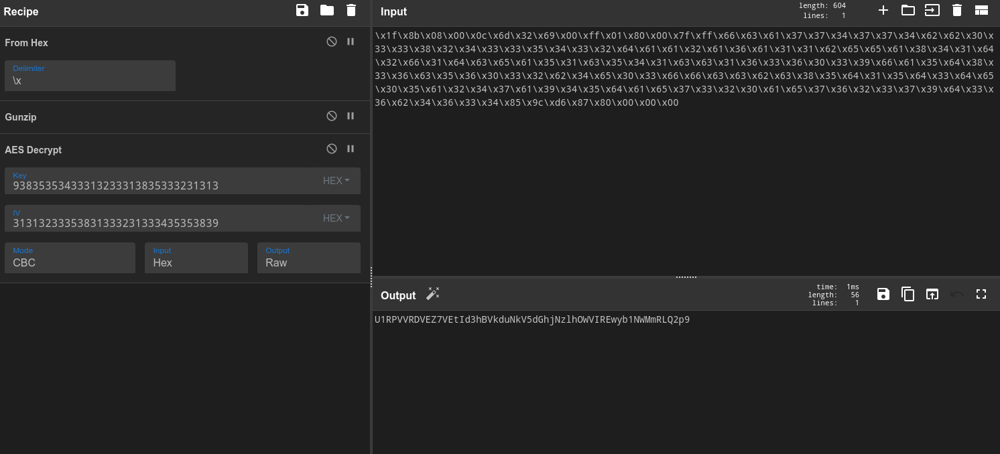
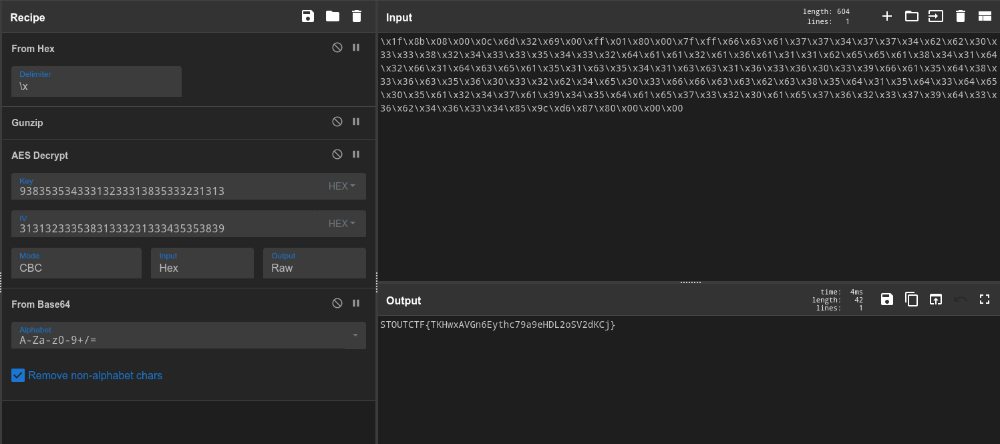

> This writeup can also be viewed [here](https://slavetomints.com/posts/stoutctf-cyber-chef-ix/)

> Challenge description:
>
>Can you decode this ciphertext?
>
>PART 1
> `\x1f\x8b\x08\x00\x0c\x6d\x32\x69\x00\xff\x01\x80\x00\x7f\xff\x66\x63\x61\x37\x37\x34\x37\x37\x34\x62\x62\x30\x33\x33\x38`
>
>PART 2
>`\x32\x34\x33\x33\x35\x34\x33\x32\x64\x61\x61\x32\x61\x36\x61\x31\x31\x62\x65\x65\x61\x38\x34\x31\x64\x32\x66\x31\x64\x63\x65\x61\x35\x31\x63\x35\x34\x31\x63\x63\x31\x36\x33\x36\x30\x33\x39\x66\x61\x35\x64\x38\x33\x36\x63\x35\x36\x30\x33\x32\x62\x34\x65\x30\x33\x66\x66\x63\x63\x62\x63\x38\x35\x64\x31`
>
>PART 3
>`\x35\x64\x33\x64\x65\x30\x35\x61\x32\x34\x37\x61\x39\x34\x35\x64\x61\x65\x37\x33\x32\x30\x61\x65\x37\x36\x32\x33\x37\x39\x64\x33\x36\x62\x34\x36\x33\x34\x85\x9c\xd6\x87\x80\x00\x00\x00`
>
>The IV is the hex representation of the first 11 numbers after 0 in the Fibonacci sequence. The Key is the reverse of the IV.

Alrighty, the first thing I want to do, is to combine all three parts together. It's the simplest way to decode all three parts at once, since they look like they've all been turned to hex the same way.



Alright, after the hex has been done, let's take a look at what we have. It doesn't immediately jump out at you, but if you save it to a file, and try to get the file type, you learn that it's a gzip archive, so lets use the `Gunzip` block next!

```terminal
file download.dat
download.dat: gzip compressed data, last modified: Fri Dec  5 05:26:36 2025, original size modulo 2^32 128
```

After we Gunzip the data, let's try out the AES Encryption. We need to get the first 11 numbers after 0 in the Fibonacci sequence, so let's write a little program that takes care of that.

```terminal
❯ irb
irb(main):001* def fibs_rec(num)
irb(main):002*   return [0,1] if num == 0
irb(main):003*   arr = fibs_rec(num - 1)
irb(main):004*   arr.push(arr[-1] + arr[-2])
irb(main):005> end
=> :fibs_rec
irb(main):006> fibs_rec(10)
=> [0, 1, 1, 2, 3, 5, 8, 13, 21, 34, 55, 89]
```

Now, let's use CyberChef's to hex feature to get the hex representation of that, and then reverse it. And now we have the key (`93835353433313233313835333231313`), and IV (`31313233353831333231333435353839`) for the `AES Decrypt` block



Alrighty, looking at this last part, it just seems like some simple Base64. Let's run that,



And look at that! All done!

FLAG: `STOUTCTF{TKHwxAVGn6Eythc79a9eHDL2oSV2dKCj}`
