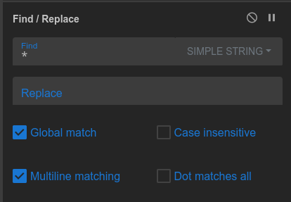

> This writeup can also be viewed [here](https://slavetomints.com/posts/guides-cyber-chef-v/)

Can you decode this ciphertext?

`**********S**********T**********O**********U**********T**********C**********T**********F**********{**********E**********4**********S**********G**********d**********t**********N**********9**********H**********t**********e**********2**********R**********E**********S**********G**********x**********h**********Y**********Y**********5**********3**********E**********V**********j**********Y**********u**********D**********l**********S**********H**********U**********}**********`

## Walkthrough

Welcome back to the CyberChef Walkthroughs! Here we are going to go through the basics of CyberChef, with a few extra challenges at the end for you to work on.

This time, we are going to look into how you can use CyberChef to do simple data sanitization. This flag is covered in asterisks, and we need to remove them. Let's also try to do this with only one `Find / Replace` block.

Now, if you simply tried to put the an asterisk into the Find field, you'd get an error. So we'd need to change it to the `Simple String` setting. And since we need to just simply remove them, we can leave the `Replace` field empty.

So our recipe should now look like this:

Now you should have your flag!

FLAG: `STOUTCTF{E4SGdtN9Hte2RESGxhYY53EVjYuDlSHU}`