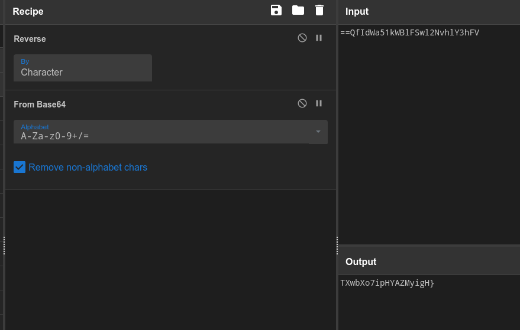
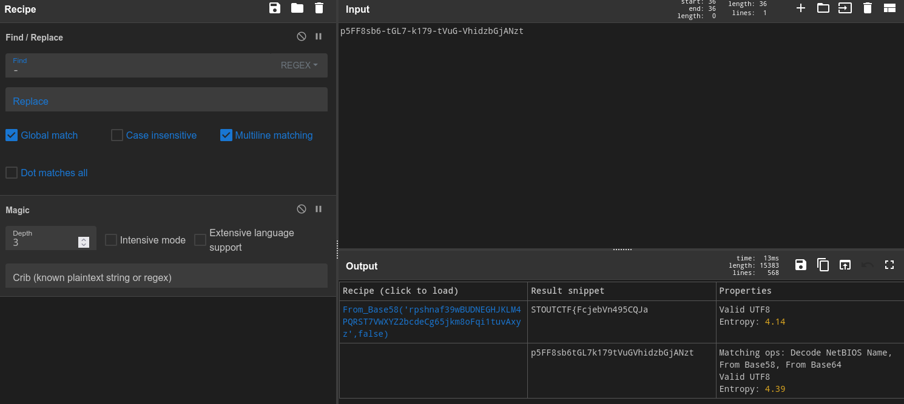

> This writeup can also be viewed [here](https://slavetomints.com/posts/stoutctf-cyber-chef-viii/)

> Challenge description:
>
>Can you find the flag in this?

```json
{
  "user": "backup",
  "id": "p5FF8sb6-tGL7-k179-tVuG-VhidzbGjANzt",
  "checksum": "==QfIdWa51kWBlFSwl2NvhlY3hFV"
}
```


Alright, this is a two-parter with some misdirection. First, lets look at each of the sections in the `JSON`. Funnily enough, for as difficult as this challenge may seem, iits just a few different types of bases obfuscated. 

The first thing we had to do was realize that the checksum, was just some Base 64 backwards. So first we pull out the `reverse` block, and then the `From Base64` block. and we now have the following: `TXwbXo7ipHYAZMyigH}`



Seeing the end bracket there, probably means that that's the end of the flag, lets look at the `id` string to try and get the first half.

Now, with this first half, given that the "checksum" was most definitely not a checksum, its probably safe to assume that the id isn't actually a UUID. So let's go ahead and remove all of the dashes, and see what CyberChef thinks of the remaining output.



Well I'll be damned *(She says as if she didn't make the challenge)*. It looks like CyberChef was able to figure out that all out needed after the replacement was a `From Base58`, and got out the beginning of the flag.

Combine the two parts, and you've got it!

FLAG: `STOUTCTF{FcjebVn495CQJaTXwbXo7ipHYAZMyigH}`
