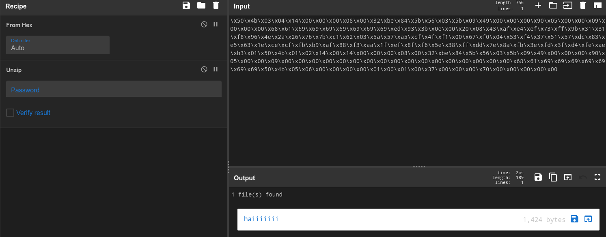
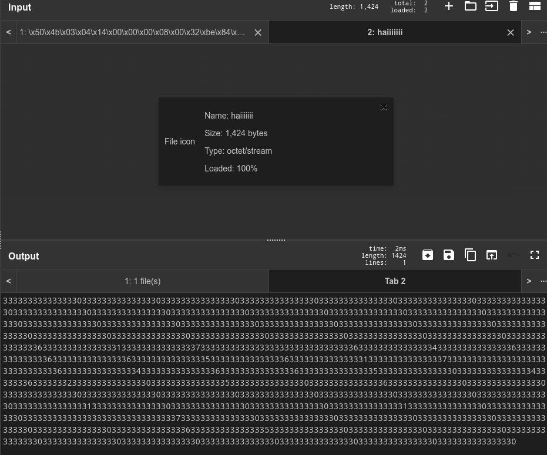

> This writeup can also be viewed [here](https://slavetomints.com/posts/stoutctf-cyber-chef-x/)

> Challenge description:
>
>Can you decode this ciphertext?
>
>PART2
>
>`GMZTGMZTGMZTGMZTGMZTGMZTGAZTGMZTGMZTGMZTGMZTGMZTGMYTGMZTGMZTGMZTGMZTGMZTGMZTIMZTGMZTGMZTGYZTGMZTGMZTGNRTGMZTGMZTGM3DGMZTGMZTGMZTGMZTGMZTGMZTMMZTGMZTGMZTGEZTGMZTGMZTGMZTGMZTGMZTGM3DGMZTGMZTGMZTGMZTGMZTGMZTSMZTGMZTGMZTGMZTGMZTGMZTGNZTGMZTGMZTGMZTGMZTGMZTGMZUGMZTGMZTGMZTGMZTGMZTGMZTGQZTGMZTGMZTGNRTGMZTGMZTGMZDGMZTGMZTGMZTGMZTGMZTGMZTIMZTGMZTGMZTGMZTGMZTGMZTGNJTGMZTGMZTGMZTGMZTGMZTGMZXGMZTGMZTGMZTGMZTGMZTGMZTHAZTGMZTGMZTGMZTGMZTGMZTGM2DGMZTGMZTGMZTGMZTGMZTGMZTCMZTGMZTGMZTGMZTGMZTGMZTGNBTGMZTGMZTGM3DGMZTGMZTGMZVGMZTGMZTGMZTGMZTGMZTGMZTHAZTGMZTGMZTGMZTGMZTGMZTGM2DGMZTGMZTGMZTGMZTGMZTGMZTSMZTGMZTGMZTGMZTGMZTGMZTGNRTGMZTGMZTGMZTGMZTGMZTGMZXGMZTGMZTGMZTGMZTGMZTGMZTGMZTGMZTGMZTGNRTGMZTGMZTGMYTGMZTGMZTGMZTGMZTGMZTGMZTKMZTGMZTGMZTGYZTGMZTGMZTGMJTGMZTGMZTGMZTGMZTGMZTGMZYGMZTGMZTGMZTGMZTGMZTGMZTGEZTGMZTGMZTGMZTGMZTGMZTGMYTGMZTGMZTGMZTGMZTGMZTGMZTAMZTGMZTGMZTGYZTGMZTGMZTGNBTGMZTGMZTGMZTGMZTGMZTGMZSGMZTGMZTGMZTMMZTGMZTGMZTGQZTGMZTGMZTGMZTGMZTGMZTGMZDGMZTGMZTGMZTGMZTGMZTGMZTKMZTGMZTGMZTGMZTGMZTGMZTGMBTGMZTGMZTGMZTGMZTGMZTGMZXGMZTGMZTGMZTMMZTGMZTGMZTGYZTGMZTGMZTGMZTGMZTGMZTGMZDGMZTGMZTGMZWGMZTGMZTGMZTMMZTGMZTGMZTGMZTGMZTGMZTGOJTGMZTGMZTGM3DGMZTGMZTGMZSGMZTGMZTGMZTMMZTGMZTGMZTGMZTGMZTGMZTGMZTGMZTGMZTGMYDGMZTGMZTGMZTGMZTGMZTGMZTSMZTGMZTGMZTGMZTGMZTGMZTGMBTGMZTGMZTGMZTGMZTGMZTGMZRGMZTGMZTGMZTGMZTGMZTGMZTHAZTGMZTGMZTGMZTGMZTGMZTGMZTGMZTGMZTGMZTGMZTGMZTGMZTQMZTGMZTGMZTGYZTGMZTGMZTGMZTGMZTGMZTGMZTGMZTGMZTGMZWGMZTGMZTGMZTGMZTGMZTGMZTGIZTGMZTGMZTGNRTGMZTGMZTGM2TGMZTGMZTGMZTGMZTGMZTGMZTIMZTGMZTGMZTGYZTGMZTGMZTGNJTGMZTGMZTGM3DGMZTGMZTGMZTGMZTGMZTGMZTMMZTGMZTGMZTGMZTGMZTGMZTGMZTGMZTGMZTGM4DGMZTGMZTGMZWGMZTGMZTGMZTKMZTGMZTGMZTGYZTGMZTGMZTGMRTGMZTGMZTGM3DGMZTGMZTGMZRGMZTGMZTGMZTMMZTGMZTGMZTGQZTGMZTGMZTGMZTGMZTGMZTGM4DGMZTGMZTGMZWGMZTGMZTGMZTIMZTGMZTGMZTGMZTGMZTGMZTGMRTGMZTGMZTGMZTGMZTGMZTGMZZGMZTGMZTGMZTMMZTGMZTGMZTGEZTGMZTGMZTGMZTGMZTGMZTGM4DGMZTGMZTGMZWGMZTGMZTGMZTEMZTGMZTGMZTGYZTGMZTGMZTGNRTGMZTGMZTGMZTGMZTGMZTGMZYGMZTGMZTGMZTGMZTGMZTGMZTGUZTGMZTGMZTGMZTGMZTGMZTGM3TGMZTGMZTGMZWGMZTGMZTGMZTCMZTGMZTGMZTGMZTGMZTGMZTGNJTGMZTGMZTGM3DGMZTGMZTGMZVGMZTGMZTGMZTGMZTGMZTGMZTG4ZTGMZTGMZTGNRTGMZTGMZTGM2TGMZTGMZTGMZTGMZTGMZTGMZTIMZTGMZTGMZTGMZTGMZTGMZTGMJTGMZTGMZTGMZTGMZTGMZTGMZRGMZTGMZTGMZTMMZTGMZTGMZTGQZTGMZTGMZTGNRTGMZTGMZTGMZTGMZTGMZTGMZTGMZTGMZTGMZTOMZTGMZTGMZTGYZTGMZTGMZTGNA=`
>
>PART4
>
>`\x50\x4b\x03\x04\x14\x00\x00\x00\x08\x00\x32\xbe\x84\x5b\x56\x03\x5b\x09\x49\x00\x00\x00\x90\x05\x00\x00\x09\x00\x00\x00\x68\x61\x69\x69\x69\x69\x69\x69\x69\xed\x93\x3b\x0e\x00\x20\x08\x43\xaf\xe4\xef\x73\xff\x9b\x31\x31\xf8\x96\x4e\x2a\x26\x76\x7b\xc1\x62\x03\x5a\x57\xa5\xcf\x4f\xf1\x00\x67\xf0\x04\x53\xf4\x37\x51\x57\xdc\x83\xe5\x63\x1e\xce\xcf\xfb\xb9\xaf\x88\xf3\xaa\x1f\xef\x8f\xf6\x5e\x38\xff\xdd\x7e\x8a\xfb\x3e\xfd\x3f\xd4\xfe\xae\xb3\x01\x50\x4b\x01\x02\x14\x00\x14\x00\x00\x00\x08\x00\x32\xbe\x84\x5b\x56\x03\x5b\x09\x49\x00\x00\x00\x90\x05\x00\x00\x09\x00\x00\x00\x00\x00\x00\x00\x00\x00\x00\x00\x00\x00\x00\x00\x00\x00\x68\x61\x69\x69\x69\x69\x69\x69\x69\x50\x4b\x05\x06\x00\x00\x00\x00\x01\x00\x01\x00\x37\x00\x00\x00\x70\x00\x00\x00\x00\x00`
>
>PART3
>
>`63,63,63,63,63,63,63,63,63,63,63,63,63,63,63,70,63,63,63,63,63,63,63,63,63,63,63,63,63,63,63,62,63,63,63,63,63,63,63,66,63,63,63,63,63,63,63,66,63,63,63,63,63,63,63,66,63,63,63,63,63,63,63,62,63,63,63,63,63,63,63,66,63,63,63,63,63,63,63,61,63,63,63,63,63,63,63,63,63,63,63,63,63,63,63,63,63,63,63,63,63,63,63,63,63,63,63,63,63,63,63,70,63,63,63,63,63,63,63,63,63,63,63,63,63,63,63,62,63,63,63,63,63,63,63,66,63,63,63,63,63,63,63,65,63,63,63,63,63,63,63,63,63,63,63,63,63,63,63,64,63,63,63,63,63,63,63,66,63,63,63,63,63,63,63,65,63,63,63,63,63,63,63,63,63,63,63,63,63,63,63,65,63,63,63,63,63,63,63,66,63,63,63,63,63,63,63,66,63,63,63,63,63,63,63,63,63,63,63,63,63,63,63,60,63,63,63,63,63,63,63,63,63,63,63,63,63,63,63,71,63,63,63,63,63,63,63,66,63,63,63,63,63,63,63,66,63,63,63,63,63,63,63,63,63,63,63,63,63,63,63,64,63,63,63,63,63,63,63,66,63,63,63,63,63,63,63,64,63,63,63,63,63,63,63,66,63,63,63,63,63,63,63,63,63,63,63,63,63,63,63,66,63,63,63,63,63,63,63,64,63,63,63,63,63,63,63,66,63,63,63,63,63,63,63,64,63,63,63,63,63,63,63,66,63,63,63,63,63,63,63,62,63,63,63,63,63,63,63,63,63,63,63,63,63,63,63,65,63,63,63,63,63,63,63,63,63,63,63,63,63,63,63,67,63,63,63,63,63,63,63,63,63,63,63,63,63,63,63,65,63,63,63,63,63,63,63,63,63,63,63,63,63,63,63,60,63,63,63,63,63,63,63,63,63,63,63,63,63,63,63,64,63,63,63,63,63,63,63,66,63,63,63,63,63,63,63,62,63,63,63,63,63,63,63,63,63,63,63,63,63,63,63,60,63,63,63,63,63,63,63,63,63,63,63,63,63,63,63,61,63,63,63,63,63,63,63,63,63,63,63,63,63,63,63,60,63,63,63,63,63,63,63,63,63,63,63,63,63,63,63,62,63,63,63,63,63,63,63,63,63,63,63,63,63,63,63,61,63,63,63,63,63,63,63,63,63,63,63,63,63,63,63,64,63,63,63,63,63,63,63,63,63,63,63,63,63,63,63,60,63,63,63,63,63,63,63,63,63,63,63,63,63,63,63,60,63,63,63,63,63,63,63,63,63,63,63,63,63,63,63,61,63,63,63,63,63,63,63,63,63,63,63,63,63,63,63,64,63,63,63,63,63,63,63,63,63,63,63,63,63,63,63,60,63,63,63,63,63,63,63,63,63,63,63,63,63,63,63,60,63,63,63,63,63,63,63,63,63,63,63,63,63,63,63,60,63,63,63,63,63,63,63,63,63,63,63,63,63,63,63,60,63,63,63,63,63,63,63,63,63,63,63,63,63,63,63,60,63,63,63,63,63,63,63,63,63,63,63,63,63,63,63,60,63,63,63,63,63,63,63,63,63,63,63,63,63,63,63,60,63,63,63,63,63,63,63,63,63,63,63,63,63,63,63,70,63,63,63,63,63,63,63,63,63,63,63,63,63,63,63,60,63,63,63,63,63,63,63,63,63,63,63,63,63,63,63,60,63,63,63,63,63,63,63,66,63,63,63,63,63,63,63,63,63,63,63,63,63,63,63,63,63,63,63,63,63,63,63,62,63,63,63,63,63,63,63,66,63,63,63,63,63,63,63,62,63,63,63,63,63,63,63,66,63,63,63,63,63,63,63,64,63,63,63,63,63,63,63,63,63,63,63,63,63,63,63,70,63,63,63,63,63,63,63,63,63,63,63,63,63,63,63,64,63,63,63,63,63,63,63,63,63,63,63,63,63,63,63,65,63,63,63,63,63,63,63,66,63,63,63,63,63,63,63,62,63,63,63,63,63,63,63,63,63,63,63,63,63,63,63,63,63,63,63,63,63,63,63,63,63,63,63,63,63,63,63,70,63,63,63,63,63,63,63,63,63,63,63,63,63,63,63,66,63,63,63,63,63,63,63,63,63,63,63,63,63,63,63,61,63,63,63,63,63,63,63,63,63,63,63,63,63,63,63,63,63,63,63,63,63,63,63,63,63,63,63,63,63,63,63,66,63,63,63,63,63,63,63,63,63,63,63,63,63,63,63,60,63,63,63,63,63,63,63,66,63,63,63,63,63,63,63,65,63,63,63,63,63,63,63,63,63,63,63,63,63,63,63,63,63,63,63,63,63,63,63,66,63,63,63,63,63,63,63,65,63,63,63,63,63,63,63,63,63,63,63,63,63,63,63,60,63,63,63,63,63,63,63,63,63,63,63,63,63,63,63,60,63,63,63,63,63,63,63,63,63,63,63,63,63,63,63,60,63,63,63,63,63,63,63,63,63,63,63,63,63,63,63,60,63,63,63,63,63,63,63,63,63,63,63,63,63,63,63,60,63,63,63,63,63,63,63,63,63,63,63,63,63,63,63,60,63,63,63,63,63,63,63,63,63,63,63,63,63,63,63,63,63,63,63,63,63,63,63,63,63,63,63,63,63,63,63,70,63,63,63,63,63,63,63,63,63,63,63,63,63,63,63,60,63,63,63,63,63,63,63,63,63,63,63,63,63,63,63,60,63,63,63,63,63,63,63,63,63,63,63,63,63,63,63,60,63,63,63,63,63,63,63,63,63,63,63,63,63,63,63,60,63,63,63,63,63,63,63,63,63,63,63,63,63,63,63,60,63,63,63,63,63,63,63,63,63,63,63,63,63,63,63,60,63,63,63,63,63,63,63,63,63,63,63,63,63,63,63,60,63,63,63,63,63,63,63,63,63,63,63,63,63,63,63,71,63,63,63,63,63,63,63,63,63,63,63,63,63,63,63,60,63,63,63,63,63,63,63,63,63,63,63,63,63,63,63,60,63,63,63,63,63,63,63,63,63,63,63,63,63,63,63,60,63,63,63,63,63,63,63,63,63,63,63,63,63,63,63,60,63,63,63,63,63,63,63,63,63,63,63,63,63,63,63,60,63,63,63,63,63,63,63,63,63,63,63,63,63,63,63,60,63,63,63,63,63,63,63,63,63,63,63,63,63,63,63,60`
>
>PART1
>
>`1G^gC1G^gC1G^gC1G^gE1G^gC1G^gC1G^gC1G^g@1G^gC1G^gC1G^gC1G^gD1G^gC1G^gF1G^gC1G^gB1G^gC1G^gC1G^gC1G^g@1G^gC1G^gC1G^gC1G^gC1G^gC1G^gC1G^gC1G^g@1G^gC1G^gC1G^gC1G^gD1G^gC1G^gC1G^gC1G^gA1G^gC1G^gC1G^gC1G^gD1G^gC1G^gC1G^gC1G^g@1G^gC1G^gC1G^gC1G^g@1G^gC1G^gC1G^gC1G^g@1G^gC1G^gC1G^gC1G^g@1G^gC1G^gC1G^gC1G^g@1G^gC1G^gC1G^gC1G^g@1G^gC1G^gC1G^gC1G^g@1G^gC1G^gC1G^gC1G^gH1G^gC1G^gC1G^gC1G^g@1G^gC1G^gC1G^gC1G^g@1G^gC1G^gF1G^gC1G^gC1G^gC1G^gC1G^gC1G^gB1G^gC1G^gF1G^gC1G^gB1G^gC1G^gF1G^gC1G^gD1G^gC1G^gC1G^gC1G^gH1G^gC1G^gC1G^gC1G^gD1G^gC1G^gC1G^gC1G^gE1G^gC1G^gF1G^gC1G^gB1G^gC1G^gC1G^gC1G^gC1G^gC1G^gC1G^gC1G^gH1G^gC1G^gC1G^gC1G^gF1G^gC1G^gC1G^gC1G^gA1G^gC1G^gC1G^gC1G^gC1G^gC1G^gC1G^gC1G^gF1G^gC1G^gC1G^gC1G^g@1G^gC1G^gF1G^gC1G^gE1G^gC1G^gC1G^gC1G^gC1G^gC1G^gF1G^gC1G^gE1G^gC1G^gC1G^gC1G^g@1G^gC1G^gC1G^gC1G^g@1G^gC1G^gC1G^gC1G^g@1G^gC1G^gC1G^gC1G^g@1G^gC1G^gC1G^gC1G^g@1G^gC1G^gC1G^gC1G^g@1G^gC1G^gC1G^gC1G^gC1G^gC1G^gC1G^gC1G^gH1G^gC1G^gC1G^gC1G^g@1G^gC1G^gC1G^gC1G^g@1G^gC1G^gC1G^gC1G^g@1G^gC1G^gC1G^gC1G^g@1G^gC1G^gC1G^gC1G^g@1G^gC1G^gC1G^gC1G^g@1G^gC1G^gC1G^gC1G^g@1G^gC1G^gC1G^gC1G^gI1G^gC1G^gC1G^gC1G^g@1G^gC1G^gC1G^gC1G^g@1G^gC1G^gC1G^gC1G^g@1G^gC1G^gC1G^gC1G^g@1G^gC1G^gC1G^gC1G^g@1G^gC1G^gC1G^gC1G^g@1G^gC1G^gC1G^gC1G^gF1G^gC1G^gC1G^gC1G^gA1G^gC1G^gC1G^gC1G^gG1G^gC1G^gC1G^gC1G^gC1G^gC1G^gC1G^gC1G^gF1G^gC1G^gC1G^gC1G^gD1G^gC1G^gC1G^gC1G^gF1G^gC1G^gC1G^gC1G^gF1G^gC1G^gC1G^gC1G^gF1G^gC1G^gC1G^gC1G^gE1G^gC1G^gC1G^gC1G^gF1G^gC1G^gC1G^gC1G^gA1G^gC1G^gC1G^gC1G^gG1G^gC1G^gC1G^gC1G^gC1G^gC1G^gC1G^gC1G^gF1G^gC1G^gC1G^gC1G^gD1G^gC1G^gC1G^gC1G^gF1G^gC1G^gC1G^gC1G^gF1G^gC1G^gC1G^gC1G^g@1G^gC1G^gC1G^gC1G^gE1G^gC1G^gC1G^gC1G^gD1G^gC1G^gC1G^gC1G^g@1G^gC1G^gF1G^gC1G^gB1G^gC1G^gC1G^gC1G^gA1G^gC1G^gC1G^gC1G^g@1G^gC1G^gF1G^gC1G^gA1G^gC1G^gC1G^gC1G^gH1G^gC1G^gC1G^gC1G^g@1G^gC1G^gC1G^gC1G^gB`


Alrighty, this one is a bit of a doozy, not only are the parts out of order in the challenge (not a big deal but annoying nonetheless). Let's go through this bit by bit

## Initial Decoding

### Part 1

Okay, so let's take a look at part 1:

`1G^gC1G^gC1G^gC1G^gE1G^gC1G^gC1G^gC1G^g@1G^gC1G^gC1G^gC1G^gD1G^gC1G^gF1G^gC1G^gB1G^gC1G^gC1G^gC1G^g@1G^gC1G^gC1G^gC1G^gC1G^gC1G^gC1G^gC1G^g@1G^gC1G^gC1G^gC1G^gD1G^gC1G^gC1G^gC1G^gA1G^gC1G^gC1G^gC1G^gD1G^gC1G^gC1G^gC1G^g@1G^gC1G^gC1G^gC1G^g@1G^gC1G^gC1G^gC1G^g@1G^gC1G^gC1G^gC1G^g@1G^gC1G^gC1G^gC1G^g@1G^gC1G^gC1G^gC1G^g@1G^gC1G^gC1G^gC1G^g@1G^gC1G^gC1G^gC1G^gH1G^gC1G^gC1G^gC1G^g@1G^gC1G^gC1G^gC1G^g@1G^gC1G^gF1G^gC1G^gC1G^gC1G^gC1G^gC1G^gB1G^gC1G^gF1G^gC1G^gB1G^gC1G^gF1G^gC1G^gD1G^gC1G^gC1G^gC1G^gH1G^gC1G^gC1G^gC1G^gD1G^gC1G^gC1G^gC1G^gE1G^gC1G^gF1G^gC1G^gB1G^gC1G^gC1G^gC1G^gC1G^gC1G^gC1G^gC1G^gH1G^gC1G^gC1G^gC1G^gF1G^gC1G^gC1G^gC1G^gA1G^gC1G^gC1G^gC1G^gC1G^gC1G^gC1G^gC1G^gF1G^gC1G^gC1G^gC1G^g@1G^gC1G^gF1G^gC1G^gE1G^gC1G^gC1G^gC1G^gC1G^gC1G^gF1G^gC1G^gE1G^gC1G^gC1G^gC1G^g@1G^gC1G^gC1G^gC1G^g@1G^gC1G^gC1G^gC1G^g@1G^gC1G^gC1G^gC1G^g@1G^gC1G^gC1G^gC1G^g@1G^gC1G^gC1G^gC1G^g@1G^gC1G^gC1G^gC1G^gC1G^gC1G^gC1G^gC1G^gH1G^gC1G^gC1G^gC1G^g@1G^gC1G^gC1G^gC1G^g@1G^gC1G^gC1G^gC1G^g@1G^gC1G^gC1G^gC1G^g@1G^gC1G^gC1G^gC1G^g@1G^gC1G^gC1G^gC1G^g@1G^gC1G^gC1G^gC1G^g@1G^gC1G^gC1G^gC1G^gI1G^gC1G^gC1G^gC1G^g@1G^gC1G^gC1G^gC1G^g@1G^gC1G^gC1G^gC1G^g@1G^gC1G^gC1G^gC1G^g@1G^gC1G^gC1G^gC1G^g@1G^gC1G^gC1G^gC1G^g@1G^gC1G^gC1G^gC1G^gF1G^gC1G^gC1G^gC1G^gA1G^gC1G^gC1G^gC1G^gG1G^gC1G^gC1G^gC1G^gC1G^gC1G^gC1G^gC1G^gF1G^gC1G^gC1G^gC1G^gD1G^gC1G^gC1G^gC1G^gF1G^gC1G^gC1G^gC1G^gF1G^gC1G^gC1G^gC1G^gF1G^gC1G^gC1G^gC1G^gE1G^gC1G^gC1G^gC1G^gF1G^gC1G^gC1G^gC1G^gA1G^gC1G^gC1G^gC1G^gG1G^gC1G^gC1G^gC1G^gC1G^gC1G^gC1G^gC1G^gF1G^gC1G^gC1G^gC1G^gD1G^gC1G^gC1G^gC1G^gF1G^gC1G^gC1G^gC1G^gF1G^gC1G^gC1G^gC1G^g@1G^gC1G^gC1G^gC1G^gE1G^gC1G^gC1G^gC1G^gD1G^gC1G^gC1G^gC1G^g@1G^gC1G^gF1G^gC1G^gB1G^gC1G^gC1G^gC1G^gA1G^gC1G^gC1G^gC1G^g@1G^gC1G^gF1G^gC1G^gA1G^gC1G^gC1G^gC1G^gH1G^gC1G^gC1G^gC1G^g@1G^gC1G^gC1G^gC1G^gB`

Hm, this reminds me of some type ofbase encoding, especially seeing how it seems to follow a certain pattern through it. After messing with it a little bit, we were able to use the `From Base85` block in CyberChef to get us to this:

`33333333333333353333333333333330333333333333333433333336333333323333333333333330333333333333333333333333333333303333333333333334333333333333333133333333333333343333333333333330333333333333333033333333333333303333333333333330333333333333333033333333333333303333333333333330333333333333333833333333333333303333333333333330333333363333333333333333333333323333333633333332333333363333333433333333333333383333333333333334333333333333333533333336333333323333333333333333333333333333333833333333333333363333333333333331333333333333333333333333333333363333333333333330333333363333333533333333333333333333333633333335333333333333333033333333333333303333333333333330333333333333333033333333333333303333333333333330333333333333333333333333333333383333333333333330333333333333333033333333333333303333333333333330333333333333333033333333333333303333333333333330333333333333333933333333333333303333333333333330333333333333333033333333333333303333333333333330333333333333333033333333333333363333333333333331333333333333333733333333333333333333333333333336333333333333333433333333333333363333333333333336333333333333333633333333333333353333333333333336333333333333333133333333333333373333333333333333333333333333333633333333333333343333333333333336333333333333333633333333333333303333333333333335333333333333333433333333333333303333333633333332333333333333333133333333333333303333333633333331333333333333333833333333333333303333333333333332`

I think we should move one, and try to see if we can get a pattern between all the parts, so we know when to combine them. On to part 2!
### Part 2
Alright, this one seems to be siimilar, what giives it away iss the equals sign at the end of the ciphertext. THis serves as padding in some types of base encodings, since it is supposed to be at a ceretain length. 

`GMZTGMZTGMZTGMZTGMZTGMZTGAZTGMZTGMZTGMZTGMZTGMZTGMYTGMZTGMZTGMZTGMZTGMZTGMZTIMZTGMZTGMZTGYZTGMZTGMZTGNRTGMZTGMZTGM3DGMZTGMZTGMZTGMZTGMZTGMZTMMZTGMZTGMZTGEZTGMZTGMZTGMZTGMZTGMZTGM3DGMZTGMZTGMZTGMZTGMZTGMZTSMZTGMZTGMZTGMZTGMZTGMZTGNZTGMZTGMZTGMZTGMZTGMZTGMZUGMZTGMZTGMZTGMZTGMZTGMZTGQZTGMZTGMZTGNRTGMZTGMZTGMZDGMZTGMZTGMZTGMZTGMZTGMZTIMZTGMZTGMZTGMZTGMZTGMZTGNJTGMZTGMZTGMZTGMZTGMZTGMZXGMZTGMZTGMZTGMZTGMZTGMZTHAZTGMZTGMZTGMZTGMZTGMZTGM2DGMZTGMZTGMZTGMZTGMZTGMZTCMZTGMZTGMZTGMZTGMZTGMZTGNBTGMZTGMZTGM3DGMZTGMZTGMZVGMZTGMZTGMZTGMZTGMZTGMZTHAZTGMZTGMZTGMZTGMZTGMZTGM2DGMZTGMZTGMZTGMZTGMZTGMZTSMZTGMZTGMZTGMZTGMZTGMZTGNRTGMZTGMZTGMZTGMZTGMZTGMZXGMZTGMZTGMZTGMZTGMZTGMZTGMZTGMZTGMZTGNRTGMZTGMZTGMYTGMZTGMZTGMZTGMZTGMZTGMZTKMZTGMZTGMZTGYZTGMZTGMZTGMJTGMZTGMZTGMZTGMZTGMZTGMZYGMZTGMZTGMZTGMZTGMZTGMZTGEZTGMZTGMZTGMZTGMZTGMZTGMYTGMZTGMZTGMZTGMZTGMZTGMZTAMZTGMZTGMZTGYZTGMZTGMZTGNBTGMZTGMZTGMZTGMZTGMZTGMZSGMZTGMZTGMZTMMZTGMZTGMZTGQZTGMZTGMZTGMZTGMZTGMZTGMZDGMZTGMZTGMZTGMZTGMZTGMZTKMZTGMZTGMZTGMZTGMZTGMZTGMBTGMZTGMZTGMZTGMZTGMZTGMZXGMZTGMZTGMZTMMZTGMZTGMZTGYZTGMZTGMZTGMZTGMZTGMZTGMZDGMZTGMZTGMZWGMZTGMZTGMZTMMZTGMZTGMZTGMZTGMZTGMZTGOJTGMZTGMZTGM3DGMZTGMZTGMZSGMZTGMZTGMZTMMZTGMZTGMZTGMZTGMZTGMZTGMZTGMZTGMZTGMYDGMZTGMZTGMZTGMZTGMZTGMZTSMZTGMZTGMZTGMZTGMZTGMZTGMBTGMZTGMZTGMZTGMZTGMZTGMZRGMZTGMZTGMZTGMZTGMZTGMZTHAZTGMZTGMZTGMZTGMZTGMZTGMZTGMZTGMZTGMZTGMZTGMZTGMZTQMZTGMZTGMZTGYZTGMZTGMZTGMZTGMZTGMZTGMZTGMZTGMZTGMZWGMZTGMZTGMZTGMZTGMZTGMZTGIZTGMZTGMZTGNRTGMZTGMZTGM2TGMZTGMZTGMZTGMZTGMZTGMZTIMZTGMZTGMZTGYZTGMZTGMZTGNJTGMZTGMZTGM3DGMZTGMZTGMZTGMZTGMZTGMZTMMZTGMZTGMZTGMZTGMZTGMZTGMZTGMZTGMZTGM4DGMZTGMZTGMZWGMZTGMZTGMZTKMZTGMZTGMZTGYZTGMZTGMZTGMRTGMZTGMZTGM3DGMZTGMZTGMZRGMZTGMZTGMZTMMZTGMZTGMZTGQZTGMZTGMZTGMZTGMZTGMZTGM4DGMZTGMZTGMZWGMZTGMZTGMZTIMZTGMZTGMZTGMZTGMZTGMZTGMRTGMZTGMZTGMZTGMZTGMZTGMZZGMZTGMZTGMZTMMZTGMZTGMZTGEZTGMZTGMZTGMZTGMZTGMZTGM4DGMZTGMZTGMZWGMZTGMZTGMZTEMZTGMZTGMZTGYZTGMZTGMZTGNRTGMZTGMZTGMZTGMZTGMZTGMZYGMZTGMZTGMZTGMZTGMZTGMZTGUZTGMZTGMZTGMZTGMZTGMZTGM3TGMZTGMZTGMZWGMZTGMZTGMZTCMZTGMZTGMZTGMZTGMZTGMZTGNJTGMZTGMZTGM3DGMZTGMZTGMZVGMZTGMZTGMZTGMZTGMZTGMZTG4ZTGMZTGMZTGNRTGMZTGMZTGM2TGMZTGMZTGMZTGMZTGMZTGMZTIMZTGMZTGMZTGMZTGMZTGMZTGMJTGMZTGMZTGMZTGMZTGMZTGMZRGMZTGMZTGMZTMMZTGMZTGMZTGQZTGMZTGMZTGNRTGMZTGMZTGMZTGMZTGMZTGMZTGMZTGMZTGMZTOMZTGMZTGMZTGYZTGMZTGMZTGNA=`

And after using the `From Base32` block, we get this:

`33333333333333303333333333333331333333333333333433333336333333363333333633333333333333363333333133333333333333363333333333333339333333333333333733333333333333343333333333333334333333363333333233333333333333343333333333333335333333333333333733333333333333383333333333333334333333333333333133333333333333343333333633333335333333333333333833333333333333343333333333333339333333333333333633333333333333373333333333333333333333363333333133333333333333353333333633333331333333333333333833333333333333313333333333333331333333333333333033333336333333343333333333333332333333363333333433333333333333323333333333333335333333333333333033333333333333373333333633333336333333333333333233333336333333363333333333333339333333363333333233333336333333333333333333333330333333333333333933333333333333303333333333333331333333333333333833333333333333333333333333333338333333363333333333333333333333363333333333333332333333363333333533333333333333343333333633333335333333363333333333333336333333333333333333333338333333363333333533333336333333323333333633333331333333363333333433333333333333383333333633333334333333333333333233333333333333393333333633333331333333333333333833333336333333323333333633333336333333333333333833333333333333353333333333333337333333363333333133333333333333353333333633333335333333333333333733333336333333353333333333333334333333333333333133333333333333313333333633333334333333363333333333333333333333373333333633333334`

Well hey, this looks a lot like the bit we got from part 1, I think it's safe to move on from here.

### Part 3

Alright, time for part 3!

`63,63,63,63,63,63,63,63,63,63,63,63,63,63,63,70,63,63,63,63,63,63,63,63,63,63,63,63,63,63,63,62,63,63,63,63,63,63,63,66,63,63,63,63,63,63,63,66,63,63,63,63,63,63,63,66,63,63,63,63,63,63,63,62,63,63,63,63,63,63,63,66,63,63,63,63,63,63,63,61,63,63,63,63,63,63,63,63,63,63,63,63,63,63,63,63,63,63,63,63,63,63,63,63,63,63,63,63,63,63,63,70,63,63,63,63,63,63,63,63,63,63,63,63,63,63,63,62,63,63,63,63,63,63,63,66,63,63,63,63,63,63,63,65,63,63,63,63,63,63,63,63,63,63,63,63,63,63,63,64,63,63,63,63,63,63,63,66,63,63,63,63,63,63,63,65,63,63,63,63,63,63,63,63,63,63,63,63,63,63,63,65,63,63,63,63,63,63,63,66,63,63,63,63,63,63,63,66,63,63,63,63,63,63,63,63,63,63,63,63,63,63,63,60,63,63,63,63,63,63,63,63,63,63,63,63,63,63,63,71,63,63,63,63,63,63,63,66,63,63,63,63,63,63,63,66,63,63,63,63,63,63,63,63,63,63,63,63,63,63,63,64,63,63,63,63,63,63,63,66,63,63,63,63,63,63,63,64,63,63,63,63,63,63,63,66,63,63,63,63,63,63,63,63,63,63,63,63,63,63,63,66,63,63,63,63,63,63,63,64,63,63,63,63,63,63,63,66,63,63,63,63,63,63,63,64,63,63,63,63,63,63,63,66,63,63,63,63,63,63,63,62,63,63,63,63,63,63,63,63,63,63,63,63,63,63,63,65,63,63,63,63,63,63,63,63,63,63,63,63,63,63,63,67,63,63,63,63,63,63,63,63,63,63,63,63,63,63,63,65,63,63,63,63,63,63,63,63,63,63,63,63,63,63,63,60,63,63,63,63,63,63,63,63,63,63,63,63,63,63,63,64,63,63,63,63,63,63,63,66,63,63,63,63,63,63,63,62,63,63,63,63,63,63,63,63,63,63,63,63,63,63,63,60,63,63,63,63,63,63,63,63,63,63,63,63,63,63,63,61,63,63,63,63,63,63,63,63,63,63,63,63,63,63,63,60,63,63,63,63,63,63,63,63,63,63,63,63,63,63,63,62,63,63,63,63,63,63,63,63,63,63,63,63,63,63,63,61,63,63,63,63,63,63,63,63,63,63,63,63,63,63,63,64,63,63,63,63,63,63,63,63,63,63,63,63,63,63,63,60,63,63,63,63,63,63,63,63,63,63,63,63,63,63,63,60,63,63,63,63,63,63,63,63,63,63,63,63,63,63,63,61,63,63,63,63,63,63,63,63,63,63,63,63,63,63,63,64,63,63,63,63,63,63,63,63,63,63,63,63,63,63,63,60,63,63,63,63,63,63,63,63,63,63,63,63,63,63,63,60,63,63,63,63,63,63,63,63,63,63,63,63,63,63,63,60,63,63,63,63,63,63,63,63,63,63,63,63,63,63,63,60,63,63,63,63,63,63,63,63,63,63,63,63,63,63,63,60,63,63,63,63,63,63,63,63,63,63,63,63,63,63,63,60,63,63,63,63,63,63,63,63,63,63,63,63,63,63,63,60,63,63,63,63,63,63,63,63,63,63,63,63,63,63,63,70,63,63,63,63,63,63,63,63,63,63,63,63,63,63,63,60,63,63,63,63,63,63,63,63,63,63,63,63,63,63,63,60,63,63,63,63,63,63,63,66,63,63,63,63,63,63,63,63,63,63,63,63,63,63,63,63,63,63,63,63,63,63,63,62,63,63,63,63,63,63,63,66,63,63,63,63,63,63,63,62,63,63,63,63,63,63,63,66,63,63,63,63,63,63,63,64,63,63,63,63,63,63,63,63,63,63,63,63,63,63,63,70,63,63,63,63,63,63,63,63,63,63,63,63,63,63,63,64,63,63,63,63,63,63,63,63,63,63,63,63,63,63,63,65,63,63,63,63,63,63,63,66,63,63,63,63,63,63,63,62,63,63,63,63,63,63,63,63,63,63,63,63,63,63,63,63,63,63,63,63,63,63,63,63,63,63,63,63,63,63,63,70,63,63,63,63,63,63,63,63,63,63,63,63,63,63,63,66,63,63,63,63,63,63,63,63,63,63,63,63,63,63,63,61,63,63,63,63,63,63,63,63,63,63,63,63,63,63,63,63,63,63,63,63,63,63,63,63,63,63,63,63,63,63,63,66,63,63,63,63,63,63,63,63,63,63,63,63,63,63,63,60,63,63,63,63,63,63,63,66,63,63,63,63,63,63,63,65,63,63,63,63,63,63,63,63,63,63,63,63,63,63,63,63,63,63,63,63,63,63,63,66,63,63,63,63,63,63,63,65,63,63,63,63,63,63,63,63,63,63,63,63,63,63,63,60,63,63,63,63,63,63,63,63,63,63,63,63,63,63,63,60,63,63,63,63,63,63,63,63,63,63,63,63,63,63,63,60,63,63,63,63,63,63,63,63,63,63,63,63,63,63,63,60,63,63,63,63,63,63,63,63,63,63,63,63,63,63,63,60,63,63,63,63,63,63,63,63,63,63,63,63,63,63,63,60,63,63,63,63,63,63,63,63,63,63,63,63,63,63,63,63,63,63,63,63,63,63,63,63,63,63,63,63,63,63,63,70,63,63,63,63,63,63,63,63,63,63,63,63,63,63,63,60,63,63,63,63,63,63,63,63,63,63,63,63,63,63,63,60,63,63,63,63,63,63,63,63,63,63,63,63,63,63,63,60,63,63,63,63,63,63,63,63,63,63,63,63,63,63,63,60,63,63,63,63,63,63,63,63,63,63,63,63,63,63,63,60,63,63,63,63,63,63,63,63,63,63,63,63,63,63,63,60,63,63,63,63,63,63,63,63,63,63,63,63,63,63,63,60,63,63,63,63,63,63,63,63,63,63,63,63,63,63,63,71,63,63,63,63,63,63,63,63,63,63,63,63,63,63,63,60,63,63,63,63,63,63,63,63,63,63,63,63,63,63,63,60,63,63,63,63,63,63,63,63,63,63,63,63,63,63,63,60,63,63,63,63,63,63,63,63,63,63,63,63,63,63,63,60,63,63,63,63,63,63,63,63,63,63,63,63,63,63,63,60,63,63,63,63,63,63,63,63,63,63,63,63,63,63,63,60,63,63,63,63,63,63,63,63,63,63,63,63,63,63,63,60`

Like the other two parts, let's keep with the theme of using a simple encoding on it. For this one, The repeated `63`'s are tipping me off to the fact that it's octal. So let's try the `From Octal` block on it (make sure you set the delimiter to `comma`). That'll get us this:

`33333333333333383333333333333332333333363333333633333336333333323333333633333331333333333333333333333333333333383333333333333332333333363333333533333333333333343333333633333335333333333333333533333336333333363333333333333330333333333333333933333336333333363333333333333334333333363333333433333336333333333333333633333334333333363333333433333336333333323333333333333335333333333333333733333333333333353333333333333330333333333333333433333336333333323333333333333330333333333333333133333333333333303333333333333332333333333333333133333333333333343333333333333330333333333333333033333333333333313333333333333334333333333333333033333333333333303333333333333330333333333333333033333333333333303333333333333330333333333333333033333333333333383333333333333330333333333333333033333336333333333333333333333332333333363333333233333336333333343333333333333338333333333333333433333333333333353333333633333332333333333333333333333333333333383333333333333336333333333333333133333333333333333333333333333336333333333333333033333336333333353333333333333333333333363333333533333333333333303333333333333330333333333333333033333333333333303333333333333330333333333333333033333333333333333333333333333338333333333333333033333333333333303333333333333330333333333333333033333333333333303333333333333330333333333333333033333333333333393333333333333330333333333333333033333333333333303333333333333330333333333333333033333333333333303333333333333330`

And this looks exactly like what we need. Finally, to part 4

### Part 4

`\x50\x4b\x03\x04\x14\x00\x00\x00\x08\x00\x32\xbe\x84\x5b\x56\x03\x5b\x09\x49\x00\x00\x00\x90\x05\x00\x00\x09\x00\x00\x00\x68\x61\x69\x69\x69\x69\x69\x69\x69\xed\x93\x3b\x0e\x00\x20\x08\x43\xaf\xe4\xef\x73\xff\x9b\x31\x31\xf8\x96\x4e\x2a\x26\x76\x7b\xc1\x62\x03\x5a\x57\xa5\xcf\x4f\xf1\x00\x67\xf0\x04\x53\xf4\x37\x51\x57\xdc\x83\xe5\x63\x1e\xce\xcf\xfb\xb9\xaf\x88\xf3\xaa\x1f\xef\x8f\xf6\x5e\x38\xff\xdd\x7e\x8a\xfb\x3e\xfd\x3f\xd4\xfe\xae\xb3\x01\x50\x4b\x01\x02\x14\x00\x14\x00\x00\x00\x08\x00\x32\xbe\x84\x5b\x56\x03\x5b\x09\x49\x00\x00\x00\x90\x05\x00\x00\x09\x00\x00\x00\x00\x00\x00\x00\x00\x00\x00\x00\x00\x00\x00\x00\x00\x00\x68\x61\x69\x69\x69\x69\x69\x69\x69\x50\x4b\x05\x06\x00\x00\x00\x00\x01\x00\x01\x00\x37\x00\x00\x00\x70\x00\x00\x00\x00\x00`


The `\x` notation is a massive giveaway that this is hex encoded, so let's use the `From Hex` block on it.

`PK........2¾.[V.[	I.......	...haiiiiiiií.;.. .C¯äïsÿ.11ø.N*&v{Áb.ZW¥ÏOñ.gð.Sô7QWÜ.åc.ÎÏû¹¯.óª.ï.ö^8ÿÝ~.û>ý?Ôþ®³.PK..........2¾.[V.[	I.......	.................haiiiiiiiPK..........7...p.....`

Hm, well I see two things here that I like. First, the PK to start the stream gives me the inclination that this is actually a zip archive. What I also see is the `haiiiiiiií` repeated, at the beginning and end of the stream, which is another thing you can find in zip archives, is filenames. It'd make sense for it to be repeated before and after the content. Using this, lets try one more thing: the `file` command.

>If you're a CyberChef purist... which does make sense for a challenge named `CyberChef X`, you'd want the `Detect File Type` block to use. However, in keeping with being a disappointment to those around me, we're going with the Bash command

```terminal
❯ file download.dat
download.dat: Zip archive data, made by v2.0, extract using at least v2.0, last modified, last modified Sun, Dec 04 2025 23:49:36, uncompressed size 1424, method=deflate
```

Yep, its a zip archive, so lets now use the `unzip` block.



And look at that! Let's throw the file (which has the same I said it would) into the input and see what we are working with. 



`33333333333333303333333333333330333333333333333033333333333333303333333333333330333333333333333033333333333333303333333333333330333333333333333033333333333333303333333333333330333333333333333033333333333333303333333333333330333333333333333033333333333333303333333333333330333333333333333033333333333333303333333333333330333333333333333033333333333333303333333333333330333333333333333033333333333333303333333333333330333333333333333033333333333333363333333333333331333333333333333733333333333333333333333333333336333333333333333433333333333333363333333333333336333333333333333633333333333333353333333333333336333333333333333133333333333333373333333333333333333333333333333633333333333333343333333333333336333333333333333633333333333333353333333333333330333333333333333433333336333333323333333333333330333333333333333533333333333333303333333333333336333333333333333033333333333333303333333333333330333333333333333033333333333333303333333333333330333333333333333033333333333333303333333333333330333333333333333133333333333333303333333333333330333333333333333033333333333333313333333333333330333333333333333033333333333333333333333333333337333333333333333033333333333333303333333333333330333333333333333033333333333333303333333333333330333333333333333633333333333333353333333333333330333333333333333033333333333333303333333333333330333333333333333033333333333333303333333333333330333333333333333033333333333333303333333333333330`

Well well well, looks like we cracked the final part, time to add them all together and see what we're working with

## Putting it all together

Alright, so if we put all parts together, in order, we get this:

`33333333333333353333333333333330333333333333333433333336333333323333333333333330333333333333333333333333333333303333333333333334333333333333333133333333333333343333333333333330333333333333333033333333333333303333333333333330333333333333333033333333333333303333333333333330333333333333333833333333333333303333333333333330333333363333333333333333333333323333333633333332333333363333333433333333333333383333333333333334333333333333333533333336333333323333333333333333333333333333333833333333333333363333333333333331333333333333333333333333333333363333333333333330333333363333333533333333333333333333333633333335333333333333333033333333333333303333333333333330333333333333333033333333333333303333333333333330333333333333333333333333333333383333333333333330333333333333333033333333333333303333333333333330333333333333333033333333333333303333333333333330333333333333333933333333333333303333333333333330333333333333333033333333333333303333333333333330333333333333333033333333333333363333333333333331333333333333333733333333333333333333333333333336333333333333333433333333333333363333333333333336333333333333333633333333333333353333333333333336333333333333333133333333333333373333333333333333333333333333333633333333333333343333333333333336333333333333333633333333333333303333333333333335333333333333333433333333333333303333333633333332333333333333333133333333333333303333333633333331333333333333333833333333333333303333333333333332333333333333333033333333333333313333333333333334333333363333333633333336333333333333333633333331333333333333333633333333333333393333333333333337333333333333333433333333333333343333333633333332333333333333333433333333333333353333333333333337333333333333333833333333333333343333333333333331333333333333333433333336333333353333333333333338333333333333333433333333333333393333333333333336333333333333333733333333333333333333333633333331333333333333333533333336333333313333333333333338333333333333333133333333333333313333333333333330333333363333333433333333333333323333333633333334333333333333333233333333333333353333333333333330333333333333333733333336333333363333333333333332333333363333333633333333333333393333333633333332333333363333333333333333333333303333333333333339333333333333333033333333333333313333333333333338333333333333333333333333333333383333333633333333333333333333333633333333333333323333333633333335333333333333333433333336333333353333333633333333333333363333333333333333333333383333333633333335333333363333333233333336333333313333333633333334333333333333333833333336333333343333333333333332333333333333333933333336333333313333333333333338333333363333333233333336333333363333333333333338333333333333333533333333333333373333333633333331333333333333333533333336333333353333333333333337333333363333333533333333333333343333333333333331333333333333333133333336333333343333333633333333333333333333333733333336333333343333333333333338333333333333333233333336333333363333333633333332333333363333333133333333333333333333333333333338333333333333333233333336333333353333333333333334333333363333333533333333333333353333333633333336333333333333333033333333333333393333333633333336333333333333333433333336333333343333333633333333333333363333333433333336333333343333333633333332333333333333333533333333333333373333333333333335333333333333333033333333333333343333333633333332333333333333333033333333333333313333333333333330333333333333333233333333333333313333333333333334333333333333333033333333333333303333333333333331333333333333333433333333333333303333333333333330333333333333333033333333333333303333333333333330333333333333333033333333333333303333333333333338333333333333333033333333333333303333333633333333333333333333333233333336333333323333333633333334333333333333333833333333333333343333333333333335333333363333333233333333333333333333333333333338333333333333333633333333333333313333333333333333333333333333333633333333333333303333333633333335333333333333333333333336333333353333333333333330333333333333333033333333333333303333333333333330333333333333333033333333333333303333333333333333333333333333333833333333333333303333333333333330333333333333333033333333333333303333333333333330333333333333333033333333333333303333333333333339333333333333333033333333333333303333333333333330333333333333333033333333333333303333333333333330333333333333333033333333333333303333333333333330333333333333333033333333333333303333333333333330333333333333333033333333333333303333333333333330333333333333333033333333333333303333333333333330333333333333333033333333333333303333333333333330333333333333333033333333333333303333333333333330333333333333333033333333333333303333333333333330333333333333333033333333333333303333333333333330333333333333333033333333333333303333333333333330333333333333333033333333333333363333333333333331333333333333333733333333333333333333333333333336333333333333333433333333333333363333333333333336333333333333333633333333333333353333333333333336333333333333333133333333333333373333333333333333333333333333333633333333333333343333333333333336333333333333333633333333333333353333333333333330333333333333333433333336333333323333333333333330333333333333333533333333333333303333333333333336333333333333333033333333333333303333333333333330333333333333333033333333333333303333333333333330333333333333333033333333333333303333333333333330333333333333333133333333333333303333333333333330333333333333333033333333333333313333333333333330333333333333333033333333333333333333333333333337333333333333333033333333333333303333333333333330333333333333333033333333333333303333333333333330333333333333333633333333333333353333333333333330333333333333333033333333333333303333333333333330333333333333333033333333333333303333333333333330333333333333333033333333333333303333333333333330`

...wow, that's a bit of a doozy. Let's throw this into CyberChef and see what `Magic` thinks of it.


Hmm, `Magic` seems to think this is the result of repeated Hex encodings, let's try working on that.

### 1 Hex Layer Removed

`3333333533333330333333343336333233333330333333333333333033333334333333313333333433333330333333303333333033333330333333303333333033333330333333383333333033333330333633333333333233363332333633343333333833333334333333353336333233333333333333383333333633333331333333333333333633333330333633353333333333363335333333303333333033333330333333303333333033333330333333333333333833333330333333303333333033333330333333303333333033333330333333393333333033333330333333303333333033333330333333303333333633333331333333373333333333333336333333343333333633333336333333363333333533333336333333313333333733333333333333363333333433333336333333363333333033333335333333343333333033363332333333313333333033363331333333383333333033333332333333303333333133333334333633363336333333363331333333363333333933333337333333343333333433363332333333343333333533333337333333383333333433333331333333343336333533333338333333343333333933333336333333373333333333363331333333353336333133333338333333313333333133333330333633343333333233363334333333323333333533333330333333373336333633333332333633363333333933363332333633333333333033333339333333303333333133333338333333333333333833363333333333363333333233363335333333343336333533363333333633333333333833363335333633323336333133363334333333383336333433333332333333393336333133333338333633323336333633333338333333353333333733363331333333353336333533333337333633353333333433333331333333313336333433363333333333373336333433333338333333323336333633363332333633313333333333333338333333323336333533333334333633353333333533363336333333303333333933363336333333343336333433363333333633343336333433363332333333353333333733333335333333303333333433363332333333303333333133333330333333323333333133333334333333303333333033333331333333343333333033333330333333303333333033333330333333303333333033333338333333303333333033363333333333323336333233363334333333383333333433333335333633323333333333333338333333363333333133333333333333363333333033363335333333333336333533333330333333303333333033333330333333303333333033333333333333383333333033333330333333303333333033333330333333303333333033333339333333303333333033333330333333303333333033333330333333303333333033333330333333303333333033333330333333303333333033333330333333303333333033333330333333303333333033333330333333303333333033333330333333303333333033333330333333303333333033333330333333303333333033333330333333303333333633333331333333373333333333333336333333343333333633333336333333363333333533333336333333313333333733333333333333363333333433333336333333363333333533333330333333343336333233333330333333353333333033333336333333303333333033333330333333303333333033333330333333303333333033333330333333313333333033333330333333303333333133333330333333303333333333333337333333303333333033333330333333303333333033333330333333363333333533333330333333303333333033333330333333303333333033333330333333303333333033333330`

### 2 Hex Layers Removed

`33353330333436323330333333303334333133343330333033303330333033303330333833303330363333323632363433383334333536323333333833363331333333363330363533333635333033303330333033303330333333383330333033303330333033303330333933303330333033303330333033363331333733333336333433363336333633353336333133373333333633343336333633303335333433303632333133303631333833303332333033313334363636333631333633393337333433343632333433353337333833343331333436353338333433393336333733333631333536313338333133313330363433323634333233353330333736363332363633393632363333303339333033313338333333383633333633323635333436353633363333383635363236313634333836343332333936313338363236363338333533373631333536353337363533343331333136343633333736343338333236363632363133333338333236353334363533353636333033393636333436343633363436343632333533373335333033343632333033313330333233313334333033303331333433303330333033303330333033303338333033303633333236323634333833343335363233333338333633313333333633303635333336353330333033303330333033303333333833303330333033303330333033303339333033303330333033303330333033303330333033303330333033303330333033303330333033303330333033303330333033303330333033303330333033303330333033363331333733333336333433363336333633353336333133373333333633343336333633353330333436323330333533303336333033303330333033303330333033303330333133303330333033313330333033333337333033303330333033303330333633353330333033303330333033303330333033303330`

### 3 Hex Layers Removed

`3530346230333034313430303030303030383030633262643834356233383631333630653365303030303030333830303030303030393030303030303631373336343636363536313733363436363035343062313061383032303134666361363937343462343537383431346538343936373361356138313130643264323530376632663962633039303138333863363265346563633865626164386432396138626638353761356537653431316463376438326662613338326534653566303966346463646462353735303462303130323134303031343030303030303038303063326264383435623338363133363065336530303030303033383030303030303039303030303030303030303030303030303030303030303030303030303030303030303631373336343636363536313733363436363530346230353036303030303030303030313030303130303337303030303030363530303030303030303030`

### 4 Hex Layers Removed

`504b0304140000000800c2bd845b3861360e3e00000038000000090000006173646665617364660540b10a802014fca69744b4578414e849673a5a8110d2d2507f2f9bc0901838c62e4ecc8ebad8d29a8bf857a5e7e411dc7d82fba382e4e5f09f4dcddb57504b01021400140000000800c2bd845b3861360e3e00000038000000090000000000000000000000000000000000617364666561736466504b0506000000000100010037000000650000000000`

### 5 Hex Layers Removed

`PK........½.[8a6.>...8...	...asdfeasdf.@±
. .ü¦.D´W..èIg:Z..ÒÒP./.À..8Æ.NÌ.ºØÒ..øW¥çä.Ü}.û£.äåð.MÍÛWPK..........½.[8a6.>...8...	.................asdfeasdfPK..........7...e.....`

...

...

...


*If you don't know this movie, I feel old. And I shouldn't feel old*

Welp, we know what to do now. Time for another `Unzip` block.

### After the Last (Hopefully) ZIP

`U1RPVVRDVEZ7ZFVhSVJmQm5PeVRyM3JHbWRYSkdRVXo3Y1hLcWxQb2t9`

And as if this challenge couldn't be any more annoying, it's hidden in some Base 64. Let's take care of that.

`STOUTCTF{dUaIRfBnOyTr3rGmdXJGQUz7cXKqlPok}`

And Victory is ours!

FLAG: `STOUTCTF{dUaIRfBnOyTr3rGmdXJGQUz7cXKqlPok}`